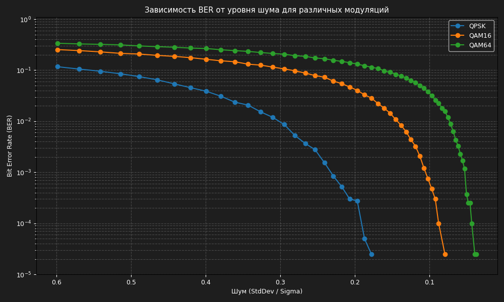

# BER simulation for QPSK, QAM16 and QAM64

This project contains a QAM modulator, AWGN channel model and QAM demodulator for QPSK, QAM16 and QAM64 modulation schemes.

The program generates a random bit sequence, performs modulation, adds Gaussian noise to the constellation, demodulates received symbols and calculates BER (Bit Error Rate).

Simulation is performed for different noise variance values in the range from `-45 dB` to `-1 dB`. Results for each modulation scheme are saved into separate CSV files.

Generated files:

```txt
qpsk.csv
qam16.csv
qam64.csv
```

Python with matplotlib is used to plot BER curves. The X-axis represents noise standard deviation `sigma`, while the Y-axis represents BER in logarithmic scale.

The results show that BER increases as noise power increases. QPSK provides the best noise immunity, while QAM64 is more sensitive to noise because of the denser constellation.

### Result

<p align="center">

</p>

## Build

```shell
mkdir -p cpp/build
cmake -S cpp -B cpp/build
cmake --build cpp/build -j

python3 -m venv python/.venv
source python/.venv/bin/activate
pip install -r python/requirements.txt
```

## Execute

```shell
bash run.sh
```
